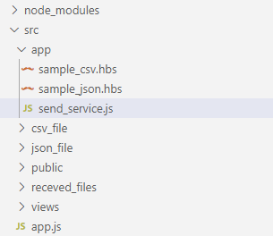

# CreateDummyFile

##### 立ち上げ手順

①コマンドプロンプト上 CreateDummyFile 階層で   `npm install`  を実行

②CreateDummyFile > src 階層（app.jsが存在する階層）にて  `node app.js`  を実行
（実行結果は下記画像参照）

③ブラウザ上で`http://localhost:3000/`を叩く

（ローカル環境の場合）

 

##### 送信先の指定

CreateDummyFile > src > app > send_service 内の12行目で送り先URLを指定

 

JSONデータを送信するRESTの部分は CreateDummyFile > src > app > send_service 内の85行目で指定

 

JSONファイルを送信するRESTの部分は CreateDummyFile > src > app > send_service 内の106行目で指定

 

CSVファイルを送信するRESTの部分は CreateDummyFile > src > app > send_service 内の129行目で指定

 

選択されたファイルを送信するRESTの部分は CreateDummyFile > src > app > send_service 内の155行目で指定

 

##### データ変更

Jsonデータ・ファイル内のデータ

CreateDummyFile > src > app > sample_json.hbs

CSVファイル内のデータ

CreateDummyFile > src > app > sample_csv.hbs

 

※データの変更の仕方は下記リンク参照

https://github.com/webroo/dummy-json
